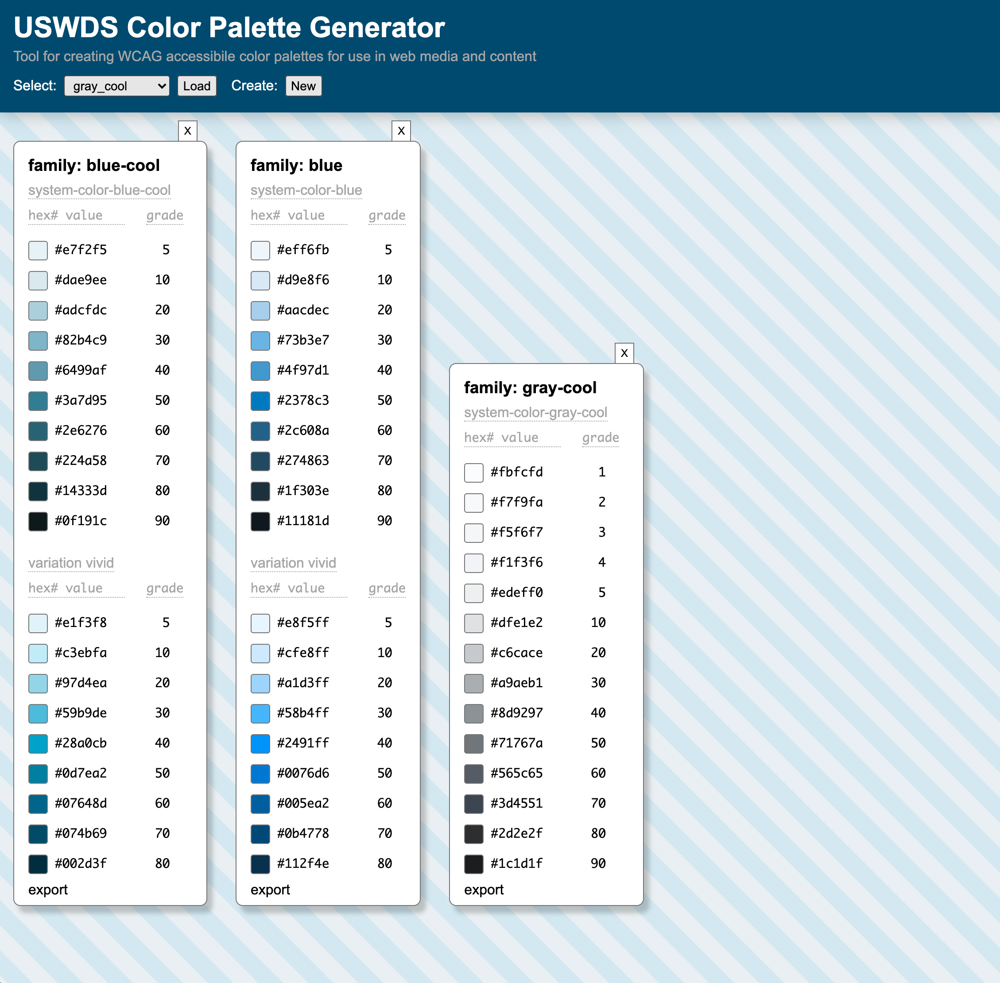
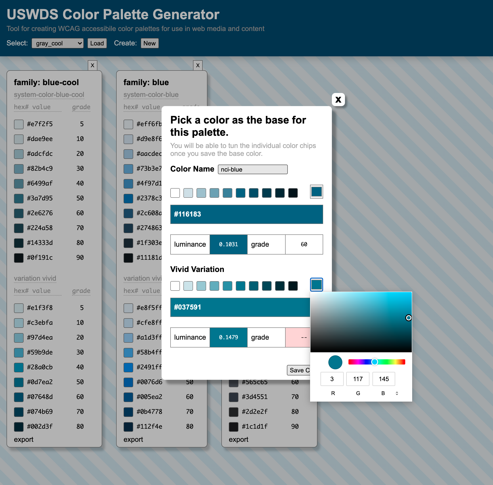

# Color Stack Builder and other Goodies


[Color stack generator](http://uswds-stacks.surge.sh/) and tools to build, consume and work with the design tokens from the USWDS - [USWDS](https://designsystem.digital.gov/design-tokens/color/overview/)

This is a simple tool to edit and build colors stacks and export that data. You start with a base hue value, which is then spread by it's stack size and evaluates the 'grade' values. Once a base color is saved you can then fine tune colors in that stack that fail the gradient check - which aligns a rating to the colors based on its luminance values. Those number values translate to WCAG AA/AAA contrast accessibility which is baked into the USWDS.

These grade values do not follow a linear scale along the luminance, rather between fixed points as listed int he table below. The colors picked by the USWDS adhear to this specification and state that the colors are not a set formal formula but manually edited to match the ratings for each grade.

| grade | minimum luminance | maximum luminance |
| ----- | :---------------: | :---------------: |
| `0`   |      `1.000`      |      `1.000`      |
| `5`   |      `0.850`      |      `0.930`      |
| `10`  |      `0.750`      |      `0.820`      |
| `20`  |      `0.500`      |      `0.650`      |
| `30`  |      `0.350`      |      `0.450`      |
| `40`  |      `0.250`      |      `0.300`      |
| `50`  |      `0.175`      |      `0.183`      |
| `60`  |      `0.100`      |      `0.125`      |
| `70`  |      `0.050`      |      `0.070`      |
| `80`  |      `0.020`      |      `0.040`      |
| `90`  |      `0.005`      |      `0.015`      |
| `100` |      `0.000`      |      `0.000`      |

##

_luminance chart from uswds_

#

## How to use

Click add, edit the color by click the input/color box in the modal. Once you find a good color value (even if not all the grades work - cause they wont) - click save.

Once you have a stack on screen you can then click an individual color box to edit that one tone / grade specifically.

While you move the color selection the application will always check the luminance values

Add or Delete stacks as needed.

Stack size can only be set before you create any stacks - once there is one active or on the page / that select is disabled.

<table><tr>
<td></td>
<td></td>
<td></td>
</tr></table>

_screen shots_

## In Development

- Consuming USWDS tokens and using a default starting point
- Contrast checker for selected colors

## To Do's:

- Import of YAML and JSON files
- Component preview

## Run the example

Requires Node v12.xx.xx or greater

```bash
$ npm install
$ npm start
```

open http://localhost:2020/
